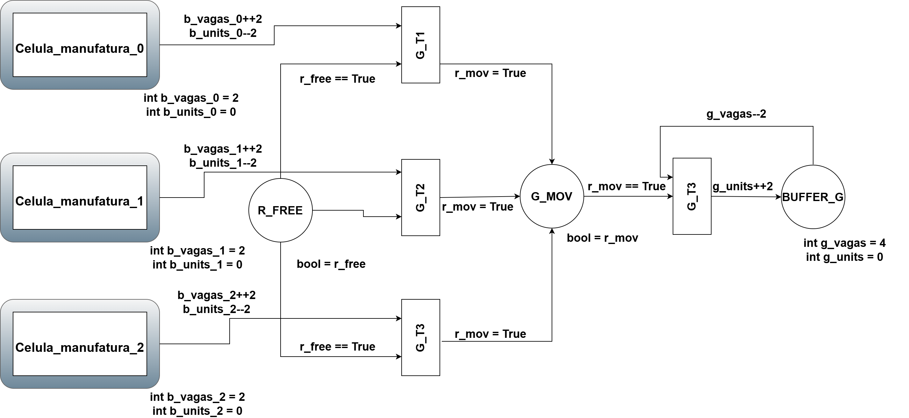
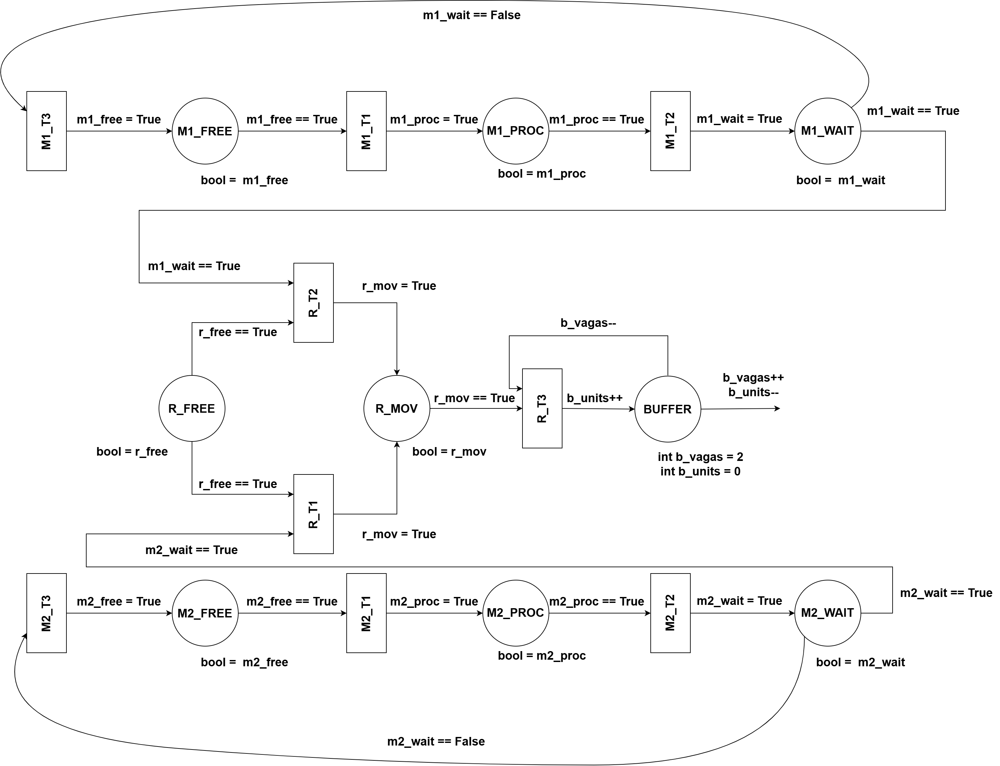

# Modelagem e Controle de Célula de Manufatura Automatizada

## 1. Contexto do Sistema
Este projeto visa a modelagem, simulação e análise de um sistema de manufatura flexível utilizando o paradigma de Sistemas a Eventos Discretos (SED) através de Redes de Petri Coloridas Hierárquicas (HCPN) e Python. O sistema é caracterizado pelo compartilhamento de recursos críticos e restrições de capacidade que, sem o devido controle lógico, podem levar a estados de bloqueio (deadlock) ou violação de especificações físicas (overflow).

O objetivo da planta é transformar matéria-prima em produtos acabados operando em duas camadas de hierarquia: três Células de Manufatura paralelas (Subpages/Submódulos) e uma malha de logística central (Top-Level). O controle gerencia o fluxo de produção garantindo que as operações ocorram de maneira assíncrona, segura e livre de gargalos catastróficos.

## 2. Arquitetura da Planta

O sistema é composto por subsistemas modulares que interagem através de interfaces de passagem de tokens e variáveis de estado:

### Máquinas 1 e 2 (Nível Célula)
Dentro de cada uma das 3 células, as estações de processamento M1 e M2 operam de forma independente. O ciclo operacional de cada máquina divide-se em três estados lógicos: repouso (FREE), processamento de tempo indeterminado (PROC) e aguardando coleta (WAIT). Uma restrição crítica do sistema é o intertravamento físico: a máquina não pode retornar ao estado inicial e iniciar um novo ciclo de produção enquanto a peça finalizada não for removida de seu terminal.

### Robôs de Transporte (Local e Global)
O sistema de transporte é dividido em dois agentes com capacidades distintas para otimizar o fluxo:

#### Robô Local
Atua de forma dedicada dentro de sua respectiva célula. Ele aguarda a flag de conclusão (wait == True) de M1 ou M2, coleta estritamente uma peça por vez, transita para o estado de movimento (R_MOV) e efetua o depósito na esteira local, retornando ao estado livre (R_FREE).

#### Robô Global (Supervisor)
Atua no nível da fábrica. Diferente do robô local, ele possui uma lógica de coleta de lote dinâmico (payload variável). Ele varre as células ativas e é capaz de transportar até 2 itens simultaneamente. Ele ajusta sua carga com base na disponibilidade instantânea dos buffers, evitando travamentos caso uma célula produza apenas um item isolado.

### Armazenamento Intermediário (Buffers Local e Global)
Responsáveis por receber os produtos acabados e equalizar a diferença de velocidade entre as máquinas e os robôs. O sistema utiliza a modelagem de "Semáforo de Vagas" para o controle rigoroso de overflow:
#### Buffer Local (Esteira)
Cada célula possui um buffer com capacidade estrita de 2 slots.

#### Depósito Global
A fábrica possui um armazém de saída com 4 slots.
O componente opera sob lógica de rejeição de hardware: o depósito de qualquer peça exige a aquisição/consumo prévio de uma "vaga". Se o contador de vagas chegar a zero, qualquer tentativa de depósito pelo robô é mecanicamente bloqueada, forçando-o a aguardar até que um agente externo libere espaço, garantindo a integridade física da planta.

Link para vídeo sobre o projeto: https://youtu.be/4KS1CGHicLI?si=iXPnqQ64d11o2oT7